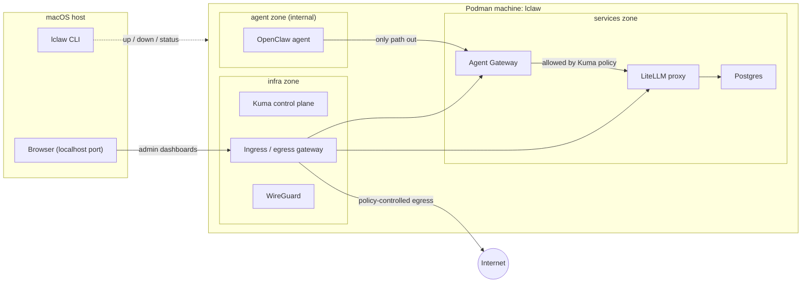

  

# LocalClaw

Run OpenClaw agents in isolated containers on macOS.

LocalClaw has two goals: isolate the agent from the host machine, and make
setup and operation easy and reliable. Everything else follows from those two.

> **Status:** pre-alpha. `lclaw up`, `down`, `status`, `doctor`, `init`
> and `secrets` exist; no release has been cut. The mesh policy between
> zones is not configured yet. See
> [Single machine](docs/explanation/single-machine.md) for why there is one
> machine rather than three.

## Architecture

Every workload runs from its upstream container image, customised through a
Containerfile in a scaffold directory that `lclaw init` writes, and is
applied as a Kubernetes Pod file with `podman kube play`.
[Flox](https://flox.dev) provides the toolchain and packages `lclaw`;
[Podman](https://podman.io) runs the containers. LocalClaw runs everything
on **one** Podman machine (a VM), split into three **zones**, each its own
Podman network, with [Kuma](https://kuma.io) providing the service mesh and
access control between them. Podman on macOS runs one machine at a time,
so the boundaries between zones are the machine's network stack, not the
hypervisor.

| Zone       | Runs                                                                               | Role                                                     |
| ---------- | ---------------------------------------------------------------------------------- | -------------------------------------------------------- |
| `infra`    | Kuma control plane, ingress/egress gateway, WireGuard                              | Mesh policy, and the only way in or out                  |
| `services` | [LiteLLM](https://github.com/BerriAI/litellm) proxy (stateful mode) with its [Postgres](https://www.postgresql.org) database, Agent Gateway | Shared model and agent gateway services                  |
| `agent`    | An OpenClaw agent                                                                  | The untrusted workload                                   |

Secrets live in a dedicated macOS keychain that `lclaw init` creates, and
are injected into the machine as Podman secrets; pod files reference them by
name and never hold a value. See
[Secrets management](docs/explanation/secrets-management.md).

### Network model

- Each zone is a Podman network. Containers on different zones cannot reach
  each other by address or by name unless a pod is deliberately placed on
  both: the Kuma control plane joins all three, and Agent Gateway joins
  `agent` and `services`. Nothing else crosses a zone.
- The `agent` zone is an internal network: the agent has no route to the
  host or the internet. It can reach only Agent Gateway, and through it only
  what a Kuma policy allows.
- The agent pod runs in its own user namespace with all capabilities
  dropped and nothing mounted from the host. It shares the machine's kernel
  with the other zones; it does not share a network with them.
- The LiteLLM and Agent Gateway admin dashboards are published through the
  `infra` gateway on a localhost port.

## The `lclaw` CLI

`lclaw` is a Go CLI that manages the lifecycle of the Podman machine, its
zones and their workloads, and provides helpers for one-off operations and
troubleshooting. Build it from source with
[Set up a development environment](docs/how-to/set-up-a-development-environment.md);
the commands that exist are in the
[command reference](docs/reference/cli.md), and the design of `lclaw up`,
`down` and `status` is in
[Lifecycle commands](docs/explanation/lifecycle-commands.md). The files it
writes and the podman sequence that applies them are in the
[scaffold reference](docs/reference/scaffold.md) and
[Apply a deployment by hand](docs/how-to/apply-a-deployment-by-hand.md).

## Documentation

Documentation lives in [`docs/`](docs/README.md) and follows
[Diátaxis](https://diataxis.fr): tutorials, how-to guides, reference and
explanation. Agents and tooling should start at [`docs/llms.txt`](docs/llms.txt).

## Contributing

Every change is made in a git worktree and lands through a pull request.
Releases follow [Semantic Versioning](https://semver.org). The full rules,
written for coding agents and humans alike, are in [AGENTS.md](AGENTS.md).

## License

[MIT](LICENSE).
