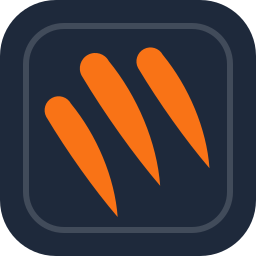
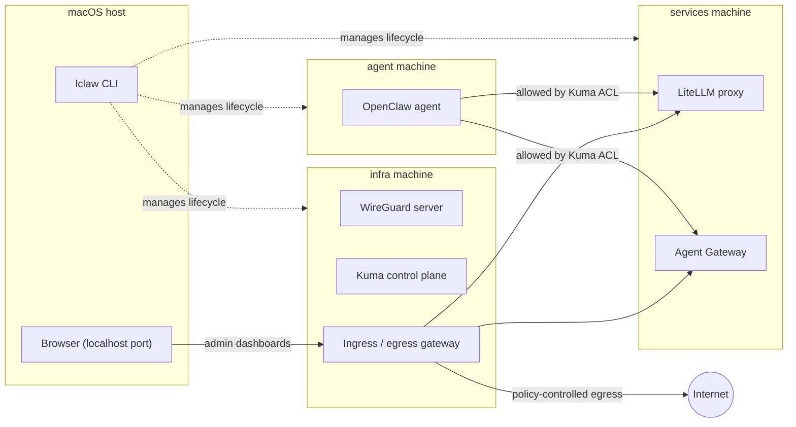

  

# LocalClaw

Run OpenClaw agents in isolated containers on macOS.

LocalClaw has two goals: isolate the agent from the host machine, and make
setup and operation easy and reliable. Everything else follows from those two.

> **Status:** pre-alpha. The `lclaw` skeleton and `lclaw doctor` exist; no
> release has been cut. The rest of this README describes the intended
> design.

## Architecture

Agents are built and managed with [Flox](https://flox.dev) and run as
containers under [Podman](https://podman.io). LocalClaw splits the system
across three Podman machines (VMs) joined by a
[WireGuard](https://www.wireguard.com) overlay, with [Kuma](https://kuma.io)
providing the service mesh and access control. Each machine isolates one set of
responsibilities.

| Machine    | Runs                                                                               | Role                                                     |
| ---------- | ---------------------------------------------------------------------------------- | -------------------------------------------------------- |
| `infra`    | WireGuard server, Kuma control plane, ingress/egress gateway                       | Overlay network, mesh policy, and the only way in or out |
| `services` | [LiteLLM](https://github.com/BerriAI/litellm) proxy (stateful mode), Agent Gateway | Shared model and agent gateway services                  |
| `agent`    | An OpenClaw agent                                                                  | The untrusted workload                                   |

### Network model

- The `agent` machine can reach only LiteLLM and Agent Gateway by default.
  Everything else is denied.
- The agent has no direct route to the internet. Egress goes through the
  `infra` gateway, and only where a Kuma access control list allows it.
- The LiteLLM and Agent Gateway admin dashboards are published through the
  Kuma gateway on a localhost port.

## The `lclaw` CLI

`lclaw` is a Go CLI that manages the lifecycle of the Podman machines and
provides helpers for one-off operations and troubleshooting. Build it from
source with
[Set up a development environment](docs/how-to/set-up-a-development-environment.md);
the commands that exist are in the
[command reference](docs/reference/cli.md).

## Documentation

Documentation lives in [`docs/`](docs/README.md) and follows
[Diátaxis](https://diataxis.fr): tutorials, how-to guides, reference and
explanation. Agents and tooling should start at [`docs/llms.txt`](docs/llms.txt).

## Contributing

Every change is made in a git worktree and lands through a pull request.
Releases follow [Semantic Versioning](https://semver.org). The full rules,
written for coding agents and humans alike, are in [AGENTS.md](AGENTS.md).

## License

[MIT](LICENSE).
